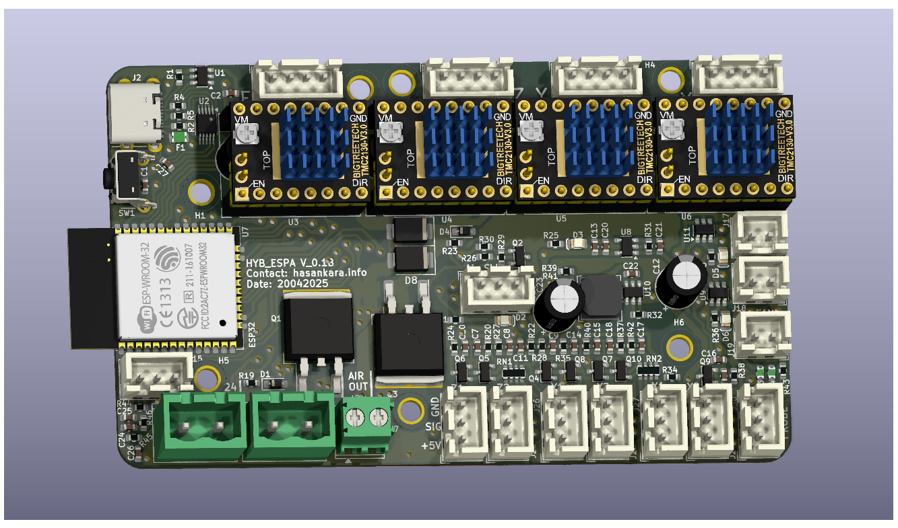
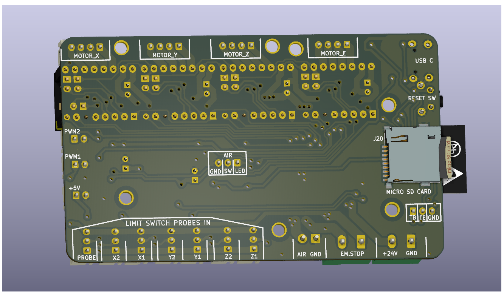
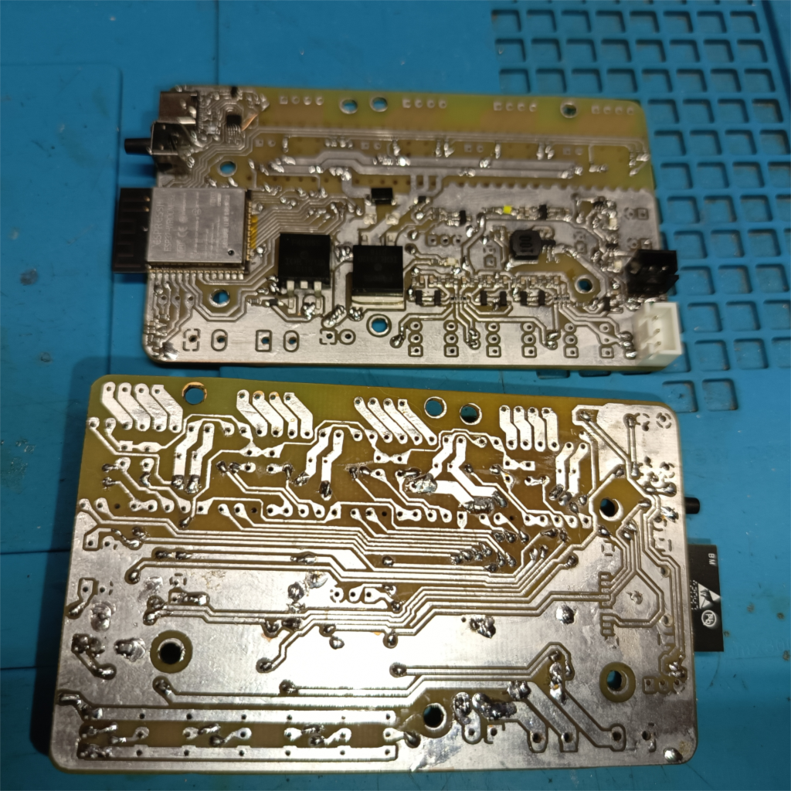
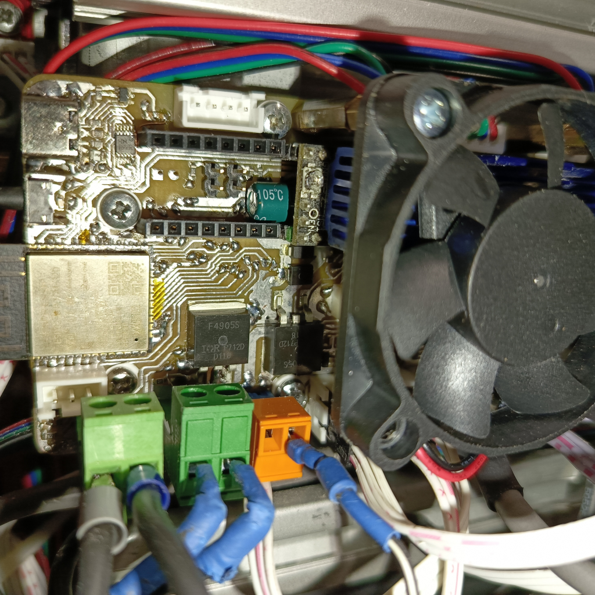

# HYB_ESPA CNC CONTROLLER BOARD
4 Adet Step motor bağlanabilir CNC kontrol kartı.

    

 Tasarım Ön Görünüm

   
    

 Tasarım Arka Görünüm 

### ESP32 ile tasarlanmış cnc kontrolcü kartlarına genel bakış;

Temelde donanımsal olarak iki farklı yapıda görmek mümkün. 
İlki daha sade olan (ESPA), doğrudan mcu pinleri ile çevresel bileşen bağlantılandırılmış. 
İkincisi ise (ESPE), bazı bileşenlerin çıkış gpio ihtiyaçları için hc595 entegreleri kullanılıyor olması.

FYSETC_E4, Hem marlin hem fluidnc hem grbl firmware yazılımlarıyla uyumlu hemde açık kaynak paylaşılan projeden şematik olarak faydalanmak mümkün.
Altium ile geliştirilen proje açık kaynak paylaşılmıştır. 4 Adet TMC2209 dahili olarak step sürücüleri üzerinde barındırıyor. 
Sürücü uart bağlantıları ve uart donanımsal adreslemesini kullanmaktadır.

MKS-TinyBee, firmware yazılımları ile yine fazlaca uyumlu, yalnız kaynak tasarım olarak açık da yalnızca pdf bulunuyor. GPIO genişleme yapısı kullanılıyor. 
5 adet motor sürücü için 2* dip-8 header standart pololu breakout yapısı kullanılarak esnek motor sürücü bağlantı seçeneği sunmakta. 
yalnız TMC2208 ve ..09 için uart bağlantısı göz ardı edilmiş. Step sürücü header pinlerindeki RST ve SLP pinleri doğrudan kısa devre edili olmaktadır.

MRR_ESPE kicad ile tasarlanmış ve açık kaynak olarak paylaşılmış, tinybee ile yapısal olarak ve mcu pin görevleri olarak fazlaca benzerliği bulunan bir proje.
ek olarak SPI uyumlu step sürücüler ile haberleşmeli kullanılabilmesi için jumper seçenekleri sunmakta. 

Step sürücü header pinlerindeki MS1, MS2, MS3, RST jumper ile kontrol edilebilirken RST ve SLP pinleri de hem jumper ile kısa devre yapılaibliyor hemde kısa devre kaldırılıp mcu ya bağlanabiliyor. Özellikle TMC2208 ve ..09 uart haberleşmesi için MS3->TX ve SLP->RX olarak kullanılabileceği için gerekli esneklikler sağlanmış olmakta. 

MRR_ESPA ise yine açık kaynak paylaşılmış gpio genişleme kullanılmayan versiyonu olarak düşünülebilir.

Uart haberleşmeli step motor sürücüleri, çoğu kontrolcüye etkili düzeyde avantaj sağlamaktadır. 
Her sürücü Uart haberleşmesi için ayrıca mcu ya bağlamak fazlaca gpio kullanımı gerektirebilir.
ESP32 nin kısıtlı pin durumu için bu bir problem haline gelir. Bu sebeple Tek bir sürücüyü hem rx hem tx ile mcu bağlayıp, tüm sürücülerin sadece rx pinlerini paralel bağlamak kısmen çözüm olabiliyor.

Toplamda 2 pin gpio kullanılarak tüm sürücülere komut gönderimi mümkün olabiliyor, özellikle mod geçişleri, eşik değerleri, akım limiti microstep gibi değerlerin güncellenmesi mümkün olur.
TMC2209 uart adresleme özelliği bulunur iken TMC2208 bu özelliği desteklemez ve adres farketmeksizin tüm komutlara geri bildirim göndermektedir.
TMC2209 step motor limit switch özelliği barındırır, TMC2208 bu özellik yine bulunmamaktadır.
TMC2209 Uart adreslemesi için MS1 ve MS2 pinlerini kullanır, farklı adreslenerek uart bağlantısı paralellenmiş TMC2209 sürücüleri ile birebir haberleşme mümkün olur. 

Tek uart bağlantısı ile çoklu TMC2208 haberleşmesi kısmen mümkün olabilmektedir. Sürücülerin hepsi rx özelliği aktif iken, yalnızca birisi tx yapabilecek donanım yapısı kurgulandığında tüm sürücülere aynı parametre yükleme başarılı olmaktadır.

Açık kaynak paylaşımlar incelendiğinde esnek ve sade yapısı ile FYSETC_E4 projesi dikkat çekmektedir. 

Kendi tasarımımızı şekillendirirken özellikle gpio numara görev atamalarında ve step motor sürücü sayısında FYSETC_E4 esinlenmiş olduk.

### Tasarıma ilişkin;
1. Step motor sürücüleri pololu breakout pin yapısına uyumlu tasarlanarak, farklı step motor sürücülerine uyumluluk sağlandı. 
2. TMC2208 sürücüleri ile kullanıldığında uart üzerinden parametre yüklenebilir iken, TMC2209 ile UART RX-TX jumper takılarak, ve sürücülerde MS1, MS2 jumper configurasyonu ile uart adreslemeli kullanılabilirlik sağlandı.
3. +24V giriş voltajı ve P-mos yapısında ters bağlantı koruma özelliği eklendi.
4. Air out çıkışı ile, 42A akım değerinde ki P-mos ile Denetleyiciden kontrol edilen güçlü bir çıkış elde edildi. 24V ile beslenen lazer yada spindle doğrudan bu terminalden beslenebilir.
5. Emergency Switch terminal ile, step motor beslemesi ve Air out çıkışı, kontrolcüden bağımsız olarak kesilebilir. Kontrolcü beslemesi ve 5V hattı enerjisi aktif devam eder.
6. 5V fan çıkışı, USB ve LimitSwitch enerji hatları bağımsız PTC sigortaları ile akım korumaları eklendi.
7. Limit switch girişleri x,y ve z eksenleri için çiftlendi, aynı eksene iki farklı limit switch eklenebilir. Limit switch bağlantısı koparsa algılayabilir. Kullanılmayan giriş gnd jumper bağlanmalıdır.
8. Boot için kullanılan gpio 0 Probe bağlantısı için de kullanılmaya başlandı. ESP32 e kod atmak için Probe pini 5v jumperda iken kart resetlenerek başlatılmalıdır.
9. Tasarım aracı olarak Kicad 9 kullanıldı.

###  Layout tarafında;
1. Arduino mega2560 fiziksel boyutlarından esinlenerek 60x100 mm^2 ile alternatif cnc kontrolcü kartlarına kıyasla daha küçük ve sade yapıda tasarlandı.
2. Çift yüz tasarım yapılırken, yalnız 0.8mm delikli vialar kullanıldı. THT komponentler yalnızca arka katmandan bağlantılandı. 
3. Komponentlerin altında via bırakılmayarak kendin yap pcb üretim teknikleri ile üretim mümkün kılındı.
4. 40x40 fan doğrudan pcb üzerine distanslar ile sabitlenebilecek şekilde M3 vida delikleri yerleştirildi.

### ÜRETİM
Profesyonel pcb üretimi için; Plot klasörü içerisinde gerber ve drill dosyaları oluşturuldu.

Kendin yap seçeneği ile pcb üretimi için;
1. Plot_DIY klasörü içerisinde pcb delim için 0.8, 0.9, 1.2, 1.4, 3 mm kalınlıklarında matkap uçlarında farklı gcode lar oluşturuldu.
2. PCB komponent lehimleme işlemi için, F_Paste lazer kesim dosyası ayrıca oluşturuldu. Standart etiket kağıdına kesim yapılabilmektedir.
3. Ön yüz ve Arka yüz lazer kazıma ve hizalaması için gerekli dosyalar oluşturuldu.
4. ESP32 montajlanırken kullanılmayan pinler kapton bant ile izolasyon sağlanmalıdır.
5. ibom klasörü içerisinde html uzantılı web browser da görüntülemek üzere bom dosyası oluşturuldu. Komponent yerleşim ve dizgisinde kullanılabilmektedir.
6. Tüm lazer cnc üretim dosyaları 30W optik gücünde ki lazer makinasına göre kurgulanmıştır. Güç oranlaması ile farklı güçte ki lazer makinalarına uygunlaştırılabilir.

### 0.1b versiyon kendin yap teknikleri ile üretilmiş prototiplere ilişkin görseller

   
    

SMD Dizgili Ön ve Arka Görünüm 

   
    

Tam Dizgili ve Makine Montajlanmış Görünüm 

İlk prototipleme ile birlikte küçük çaplı düzeltmeler tasarımda ve üretim dosyalarında güncellenmiş (v0.1) haldedir.

Bom list oluşturulurken Türkiye piyasasından temin edilmek üzere ürün linkleri oluşturuldu. Yalnız CH340E IC yerli piyasada bulunamadı. 
Belirtilen fiyat bilgileri için ise, vergiler dahil edildi, güncel dolar kuru esas alındı ve dolara çevrildi.

### Bazı testlere ilişkin;
1. Firmware olarak fluidnc v3.9.4 yüklendi. Kontrolcüyle uyumlu, oluşturulan config.yaml dosyası "Settings/" dizini içerisine yerleştirildi.
2. X, Y ve Z eksenleri için 3 adet TMC2208 step motor sürücüleri bağlandı. Tüm sürücülere parametre yükleme yapılabildiği teyit edildi.
3. Arayüz olarak UGS (version 2.1.12) ile bağlanarak temel testler başarıyla sağlandı. 
4. Fiziksel SD kart takılarak web arayüz üzerinden .gcode yüklendi ve ilgili gcode çalıştırıldı. 
5. AirOut çıkışına fiziksel röle bağlandı ve röle çıkışına spindle 220V beslemesi bağlandı.
6. Fluidnc config ayarlarında AirOut çıkışı pwm enable pini ile ilişkilendirildi. 
7. M3 komutu çalıştırılarak Spindle enerjisi sağlandı, M5 komutu çalıştırıldığında Spindle enerjisi otomatik kesildi.
8. Pwm çıkışı ile spindle motor hız ayarı çalıştırıldı.
9. Kontrolcü spindle için enerji çıkışı sağlarken de acil stop basıldığında, spindle enerjisi doğrudan kesilebildi.
10. Limit switch kablo temassızlığı algılanabildiği görüldü.
